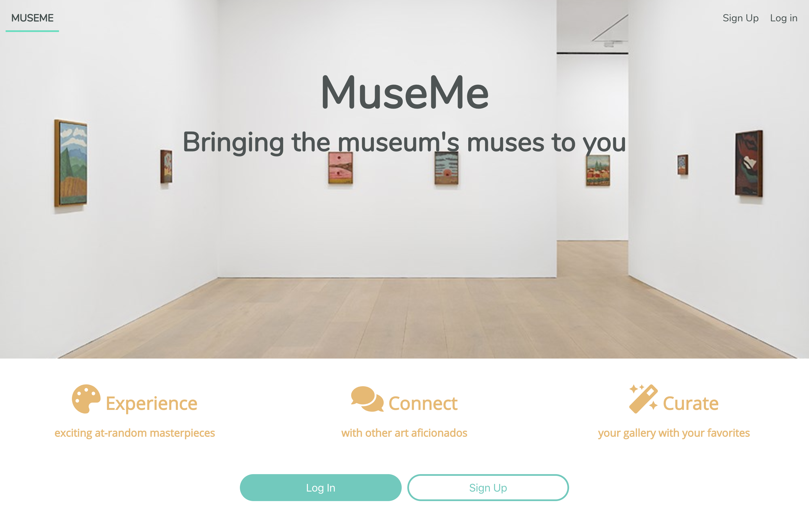

# MUSEME

This application allows users to view randomized art from The Metropolitan Museum of Art Collection in New York City. Users can save art to their own curated gallery which they can view at any time, and users can comment along with other art aficionados.

## Working Prototype
[MUSEME API Repo](https://github.com/brandiherrera/museum-app-full-stack-capstone-server)

[MUSEME React Repo](https://github.com/brandiherrera/museum-app-full-stack-capstone-react)

[Live app](https://museum-app-full-stack-capstone-react.brandiherrera.now.sh/)

<!-- [Live MUSEME Application]() -->

## Site Map: MVP

## User Stories

**Landing Page**

As a new user I want to understand the purpose of the app so I can decide if I want to sign up.

**Sign Up Page**

As a new user I want to sign up for the app so I can use it to view random artwork, save to my own gallery if I wish, and comment on pieces and discuss the artwork with other users.

**Log In Page**

As a returning user I want to log in so I can have access to random art, my saved gallery, and other users' thoughts and comments on various artwork.

**Dashboard**

As a returning user I want to view a randomly generated piece of art in addition to comments from other users. I also want to save the art to my gallery if I wish, so I can view it at a later time.

**Gallery**

As a returning user I want to view my gallery so I can enjoy artwork that I like at my leisure.

**Art Page**

As a returning user I want to view artwork that I have saved in greater detail at my leisure so I can enjoy it, view other comments, and add comments of my own.

**Comments**

As a returning user I want to post comments on various pieces of art so I can enter discussions with other users or simply to share my thoughts with myself and other users. I want to be able to view them in real-time and at a later date as I wish.

**Log Out Page**

As a returning user I want to access a log out so I can log out at my convenience.

## Live Screenshots

### **Landing Page**

### **Sign Up Page**

### **Log In Page**

### **Dashboard**

### **Gallery**

### **Art Page**

<!-- ### **Comments**

 -->

## Technology Used

<b>Front End</b>
* HTML5
* CSS3
* JavaScript
* React
* Jest and Enzyme for testing
  
<b>Back End</b>
* Node.js
* Express.js
* PostgreSQL
* Mocha and Chai for testing

## Scripts

Install node modules `npm install`

Run the tests `npm test`

Start the application `npm start`